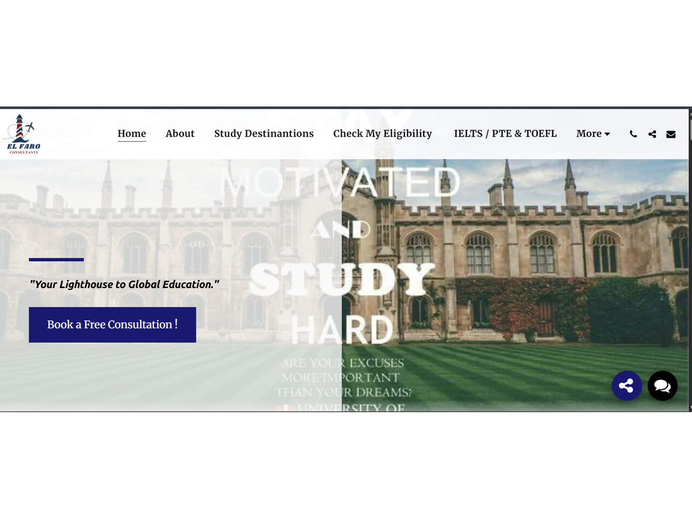
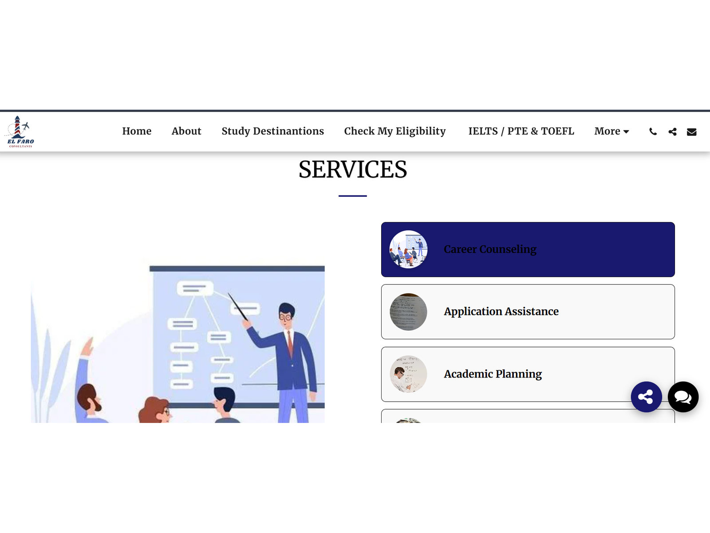
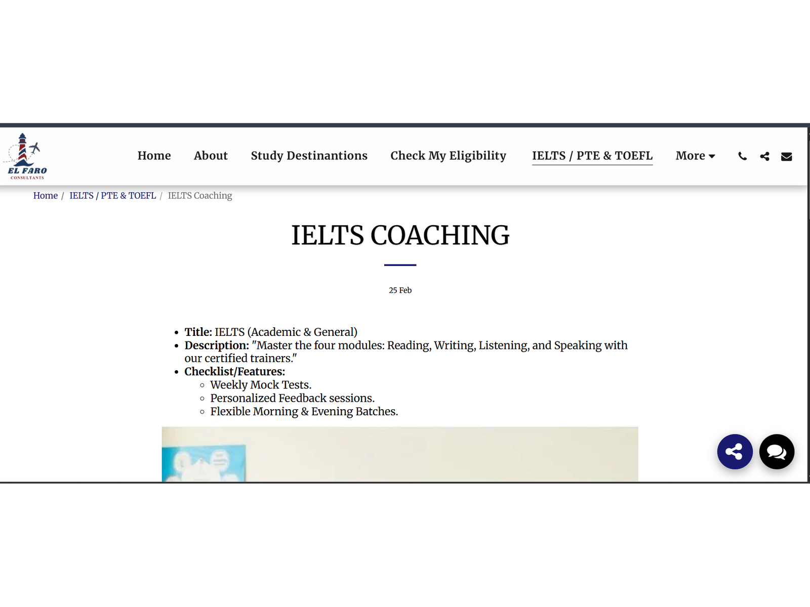

# EL FARO Consultants — Website Design Project

**Live site:** [elfaroconsultants.com](https://www.elfaroconsultants.com)

A full website design for an education consultancy helping students apply to universities abroad. This repository documents the design process, structure, and AI-assisted workflow used to build the site — the site itself was built on the SITE123 platform, so no source code lives here; this repo serves as design documentation and a portfolio record.

---

## Overview

**Client:** EL FARO Consultants
**Role:** Web Designer
**Tagline:** *"Your Lighthouse to Global Education."*

EL FARO Consultants needed a site that could convert visitors — prospective students — into booked consultations, while clearly communicating the range of services offered (career counseling, application assistance, visa guidance, test prep, and more).

## What I Designed

- **Homepage hero** — clear value proposition, tagline, and a single primary call-to-action ("Book a Free Consultation")
- **Eligibility check form** — a lead-capture form that qualifies visitors by education level, target country, and test status before they ever talk to a human
- **Services grid** — seven core services (Career Counseling, Application Assistance, Academic Planning, Scholarship & Financial Aid Support, Pre-Departure & Settlement Support, Visa & Immigration Guidance, University & Program Selection), each with its own icon and short description
- **IELTS / PTE / TOEFL section** — dedicated sub-pages for test prep offerings, including feature checklists (mock tests, personalized feedback, flexible scheduling)
- **Testimonials** — social proof from past students
- **FAQ section** — answers to the most common pre-consultation questions (eligibility, cost, visa requirements, language)
- **Contact section** — phone, email, and social links, with consistent navy/red branding throughout

## Design Process

1. **Information architecture first** — mapped out the visitor journey (Home → Study Destinations → Eligibility Check → Services → Book a Call) before touching layout, so every page had a clear next step
2. **Conversion-focused structure** — placed the eligibility form and booking CTA early and repeated the CTA at multiple points, rather than burying it at the bottom
3. **AI-assisted copywriting** — used AI tools to draft and refine copy across service descriptions, the FAQ section, and test-prep pages, then edited for tone and accuracy
4. **Consistent branding** — carried the lighthouse motif and navy/red color palette across every section for visual cohesion

## Tools Used

- **SITE123** — website builder/hosting platform
- **AI copywriting tools (Claude)** — content drafting and refinement

## Skills Demonstrated

- Web Design
- Information Architecture
- Conversion-Focused UX
- AI-Assisted Content Creation

---

*This repository is a portfolio record, not a code repository. For the working project, visit [elfaroconsultants.com](https://www.elfaroconsultants.com).*
## Screenshots

**Homepage**

**Services**

**IELTS Coaching Detail Page**

